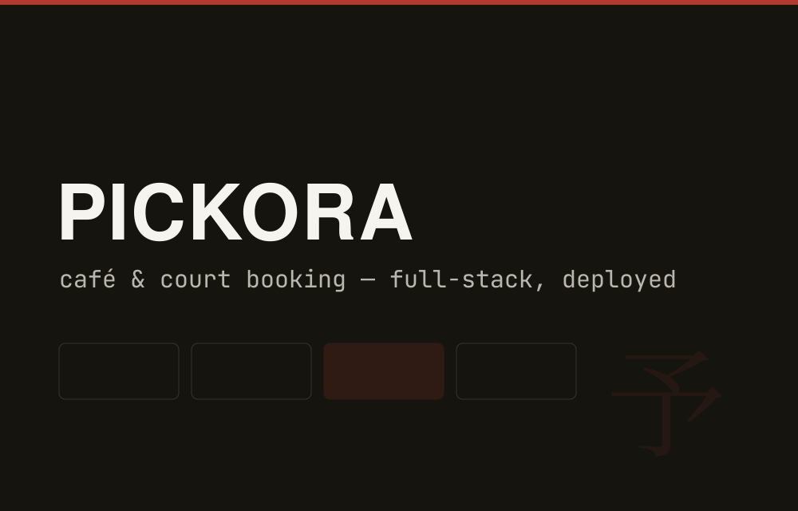

# PICKORA — Café & Court Booking Platform


> Full-stack booking platform replacing manual reservations for a real café & sports venue. Live and in daily use.



---

## What it does

PICKORA is a real booking system deployed for a local café and sports court venue in Udaipur. It handles:

- **Customer-facing flow** — browse available slots, select a time, book and receive confirmation
- **Real-time availability** — Firebase Realtime Database ensures no double-booking across concurrent users
- **Admin dashboard** — venue staff can view all bookings, mark slots unavailable, manage customer data
- **Booking history** — customers can look up past and upcoming reservations

---

## Stack

| Layer | Tech |
|-------|------|
| Frontend | React 18 + TypeScript |
| Styling | Tailwind CSS |
| Backend / DB | Firebase (Firestore + Auth) |
| Real-time sync | Firestore `onSnapshot` listeners |
| Hosting | Firebase Hosting |
| Auth | Firebase Auth (email + Google) |

---

## Architecture

```
src/
  ├── pages/
  │   ├── Home.tsx          Venue overview + slot browser
  │   ├── Book.tsx          Booking flow (date → slot → confirm)
  │   └── Dashboard.tsx     Admin panel (auth-gated)
  ├── components/
  │   ├── SlotGrid.tsx      Real-time availability grid
  │   ├── BookingCard.tsx   Booking summary + cancel
  │   └── AdminTable.tsx    Booking management table
  ├── hooks/
  │   ├── useSlots.ts       Firestore real-time slot listener
  │   └── useBookings.ts    Booking CRUD
  └── firebase/
      ├── config.ts         Firebase init (env vars)
      └── db.ts             Firestore helpers
```

**Slot locking** — when a user opens a booking form for a slot, a Firestore transaction places a 3-minute lock. If they don't complete, the lock expires and the slot reopens. This prevents the "two people booking the same slot" race condition.

---

## Real-Time Flow

```
User selects slot
  → Firestore transaction: check availability + write lock
  → onSnapshot listener on all clients updates UI
  → Slot marked "pending" for 3 min
User confirms booking
  → Transaction converts lock → confirmed booking
  → Email confirmation sent via Firebase Cloud Functions
```

---

## Admin Features

- View all bookings (sorted by date, filter by status)
- Block out dates/times (maintenance, events)
- Export booking history as CSV
- Customer contact list

---

## Setup (Development)

```bash
git clone https://github.com/kavinjainn/pickora
cd pickora
npm install

# Configure Firebase
cp .env.example .env
# Add your VITE_FIREBASE_* keys from Firebase console

npm run dev
```

For production deploy: `firebase deploy`

---

## About

Built by [Kavin Jain](https://kavinjain.in) for a real local venue. The system replaced a WhatsApp-based manual booking flow.
